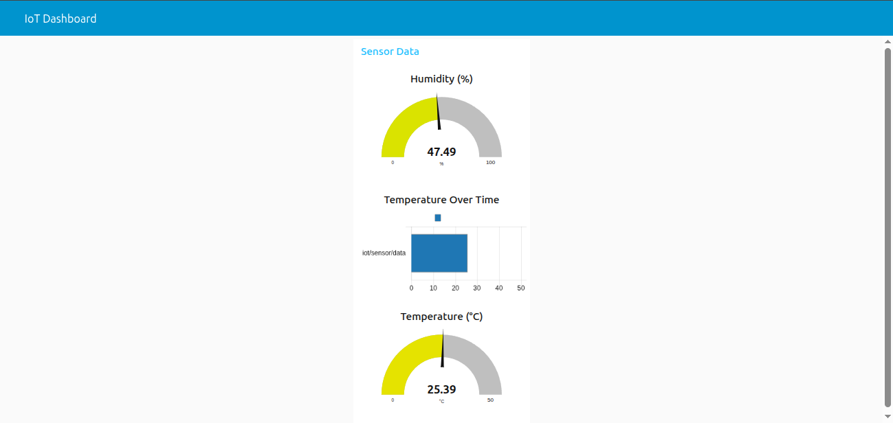

# IoT Sensor Simulator with Real-Time Dashboard

A complete IoT simulation system that generates environmental data (temperature & humidity) and visualizes it in real time using MQTT and Node-RED.

This project mimics a real-world IoT architecture, from device-level data generation to live monitoring dashboards.

---

## Features

* Simulated IoT device (ESP32-like behavior)
* Real-time data generation (temperature & humidity)
* MQTT communication (publish/subscribe model)
* Live dashboard visualization (Node-RED UI)
* Clean and modular architecture
* Easy to extend for real hardware integration

---

## Architecture

```
Sensor Simulator (Python) → MQTT Broker (Mosquitto) → Node-RED → Dashboard UI
```

This reflects a real IoT pipeline used in production systems.

---

## Technologies Used

* Python
* MQTT (Mosquitto)
* Node-RED (Dashboard)
* JSON

---

## Dashboard Preview



---

## ⚙️ How to Run

### 1. Clone repository

```
git clone git@github.com:alcides-dev-iot/iot-sensor-simulator.git
cd iot-sensor-simulator
```

---

### 2. Create virtual environment

```
python3 -m venv venv
source venv/bin/activate
```

---

### 3. Install dependencies

```
pip install -r requirements.txt
```

---

### 4. Start MQTT Broker (Mosquitto)

```
sudo systemctl start mosquitto
```

Check status:

```
systemctl status mosquitto
```

---

### 5. Run Node-RED

```
node-red
```

Open in browser:

```
http://localhost:1880
```

---

### 6. Import Node-RED Flow

* Go to Menu → Import
* Paste your saved flow JSON
* Click **Deploy**

---

### 7. Run the simulator

```
python main.py
```

---

### 8. Open Dashboard

```
http://localhost:1880/ui
```

---

## 🧪 Debugging (Optional but Pro)

Monitor MQTT messages directly:

```
mosquitto_sub -h localhost -t iot/sensor/data
```

Or all topics:

```bash
mosquitto_sub -h localhost -t "#" -v
```

---

## Use Cases

* IoT system prototyping
* Real-time monitoring dashboards
* MQTT-based architectures
* Edge-to-dashboard pipelines
* Educational/demo environments

---

## Future Improvements

* Cloud deployment (AWS / Azure)
* Database integration (MongoDB / PostgreSQL)
* Multi-device simulation
* Authentication & security (MQTT)
* Integration with AI anomaly detection system

---

## Author

**Alcides Castro**

IoT Developer focused on real-time systems, MQTT communication, and data visualization.

---


